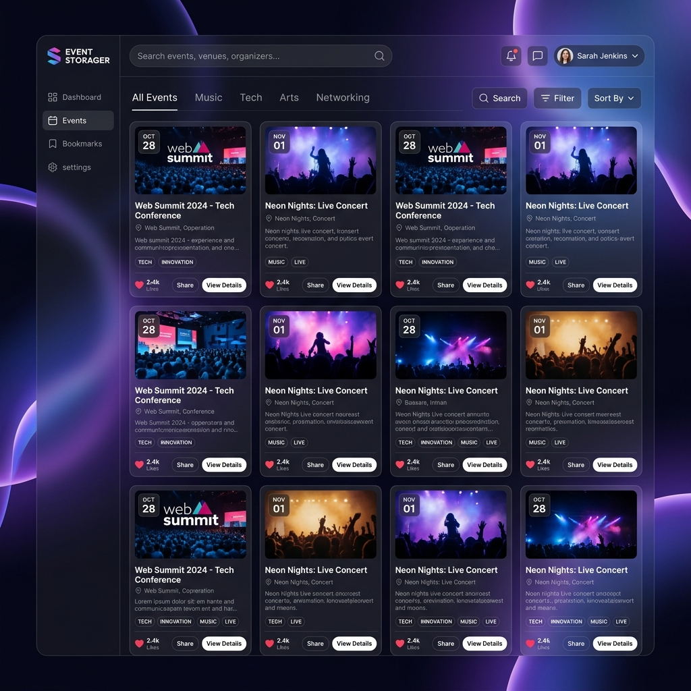
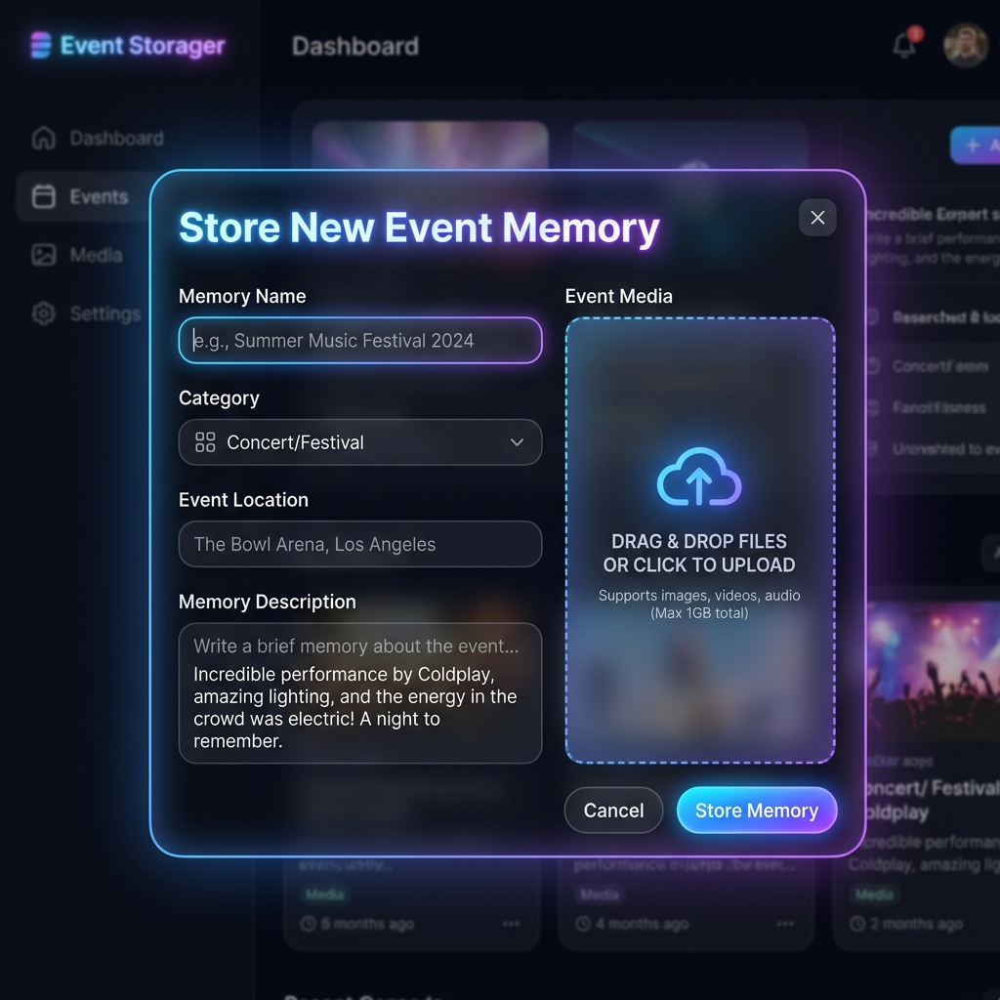

# 1. Project Name
# Event Storager | Digital Event & Media Vault 📦⚡

---

## 2. Problem Statement
Managing memories, photos, videos, and documents from diverse events (such as conferences, celebrations, concerts, and personal milestones) is often fragmented across multiple devices, cloud drives, and chat apps. Finding specific media files or organizing highlights long after an event ends can be frustrating and slow.

**Event Storager** solves this problem by providing a centralized, high-performance digital event vault. Users can capture, categorize, search, preview, and securely archive event memories with media assets in a unified, visually stunning interface.

---

## 3. Features

### 🌟 Core Features
- **Media Asset Vault**: Upload photos (JPG, PNG, GIF, WebP), videos (MP4, WebM), audio clips (MP3, WAV), and documents (PDF) up to 50MB per file.
- **Drag-and-Drop Uploader**: Intuitive file drop zone with real-time media thumbnail and file size preview.
- **Full CRUD Support**: Create new event memories, view stored vaults, edit title/description/tags/location or replace media assets, and delete unwanted events.
- **Instant Search & Category Filters**: Search across titles, descriptions, locations, and tags with debounced real-time query matching. Filter by categories: *Concerts, Conferences, Celebrations, Sports, Personal, Other*.
- **Interactive Media Lightbox**: High-resolution lightbox modal equipped with video/audio media players, single-click like counter, direct file downloading, and author attribution.
- **Glassmorphic Responsive UI**: Modern dark design system built with custom CSS tokens, smooth micro-animations, background ambient glows, grid/list view toggling, and mobile optimization.

### 🎁 Bonus Features
- **JWT User Authentication**: Secure login and sign-up portal utilizing JSON Web Tokens (`jsonwebtoken`) and password hashing (`bcryptjs`).
- **User Ownership & Badges**: Authenticated user badge displayed in header with user initials avatar, event author tracking, and owner permissions.
- **Active In-Memory Fallback System**: Seamless fallback mode allowing full application functionality even when MongoDB is offline or unavailable locally.

---

## 4. Technology Stack

- **Frontend**: HTML5, Vanilla JavaScript (ES6+), Vanilla CSS3 (Custom Design System, Glassmorphism, Flexbox, Grid)
- **Backend**: Node.js, Express.js framework, Multer (Multipart Form Data File Upload Middleware)
- **Database**: MongoDB with Mongoose ORM + Active In-Memory Engine Fallback
- **Authentication**: JWT (JSON Web Tokens), `bcryptjs` (Password Salt Hashing)
- **Environment & Tools**: `dotenv`, Cors, Nodemon

---

## 5. Screenshots

### Main Application Gallery Dashboard


### Store New Event & Media Upload Modal


---

## 6. Live Demo
- **Vercel Frontend URL**: [https://event-storager.vercel.app](https://event-storager.vercel.app)

---

## 7. Backend
- **Deployed Backend / API Base URL**: [https://event-storager-api.vercel.app](https://event-storager-api.vercel.app)
- **Local API Base Endpoint**: `http://localhost:5000/api/posts`

---

## 8. Setup Instructions

Follow these step-by-step instructions to run Event Storager locally on your machine:

### 1. Prerequisites
- [Node.js](https://nodejs.org/) (v16.0.0 or higher)
- [npm](https://www.npmjs.com/) (Node Package Manager)
- [MongoDB](https://www.mongodb.com/) (Optional: System runs with active in-memory fallback if MongoDB is not running locally)

### 2. Clone the Repository
```bash
git clone https://github.com/your-username/event-storager.git
cd event-storager
```

### 3. Install Dependencies
Install all required package dependencies:
```bash
npm install
```

### 4. Configure Environment Variables
Copy the `.env.example` file to create your local `.env` configuration file inside the `backend/` directory:
```bash
cp backend/.env.example backend/.env
```
*(Refer to Section 9 below for required environment variable definitions).*

### 5. Launch the Server
Start the development server:
```bash
npm run dev
# or for standard production launch:
npm start
```

### 6. Access the Application
Open your Web Browser and navigate to:
**`http://localhost:5000`**

---

## 9. Environment Variables

The application requires the following environment variables to run securely. 

> [!CAUTION]
> **Important Security Requirement**: Never commit `.env` files, API keys, passwords, JWT secrets, or sensitive credentials to GitHub. Always list them in `.gitignore`.

Create a `.env` file in the `backend/` directory specifying the following keys:

| Variable Name | Required | Description | Example Placeholder |
| :--- | :--- | :--- | :--- |
| `PORT` | Optional | Port number for Express server (Defaults to `5000`) | `5000` |
| `MONGO_URI` | Required | MongoDB database connection string | `mongodb://127.0.0.1:27017/eventStorager` |
| `JWT_SECRET` | Required | Secret key used for signing & verifying JWT authentication tokens | `your_secret_jwt_key_here` |
